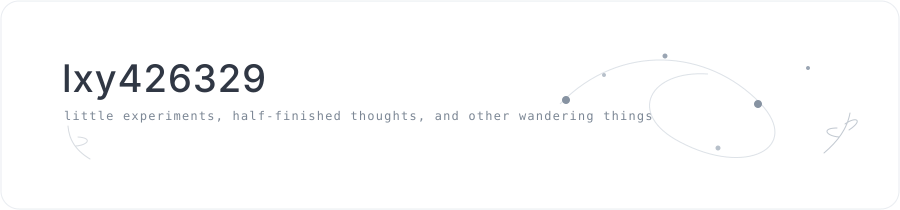
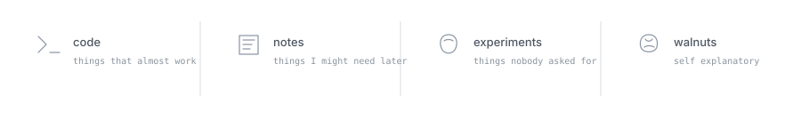
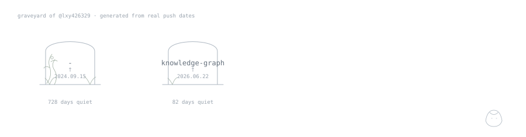

  

### things wandering around here

### project graveyard

<!-- graveyard-links:start -->
↗ [-](https://github.com/lxy426329/-) · [knowledge-graph](https://github.com/lxy426329/knowledge-graph)
<!-- graveyard-links:end -->

Nothing here is truly dead. Some repositories are just being extremely quiet.

tiny drawer

 

- probably testing something
- probably forgot why I opened this tab
- probably keeping it anyway

<!-- if you found this: yes, the walnut is intentional. -->
